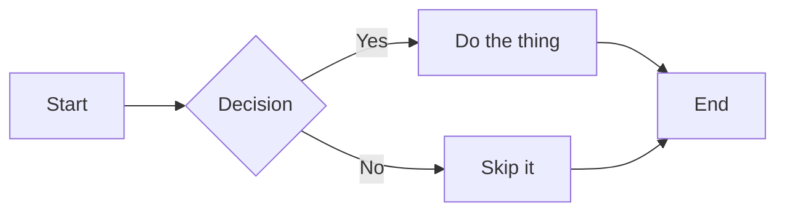
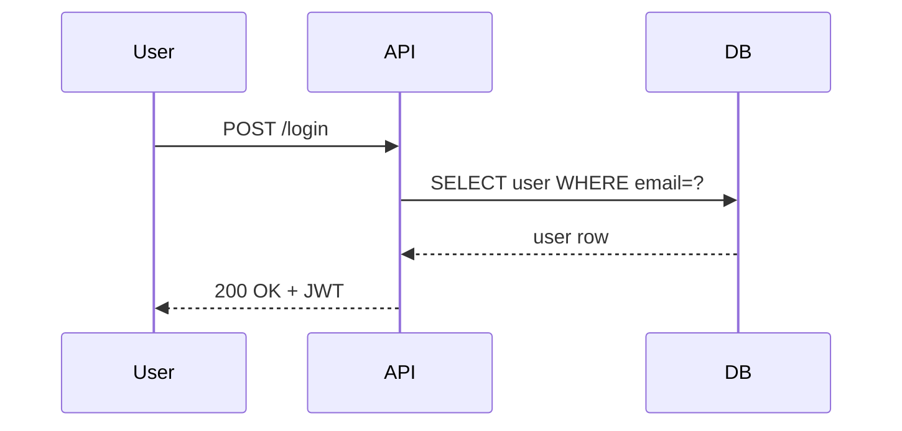
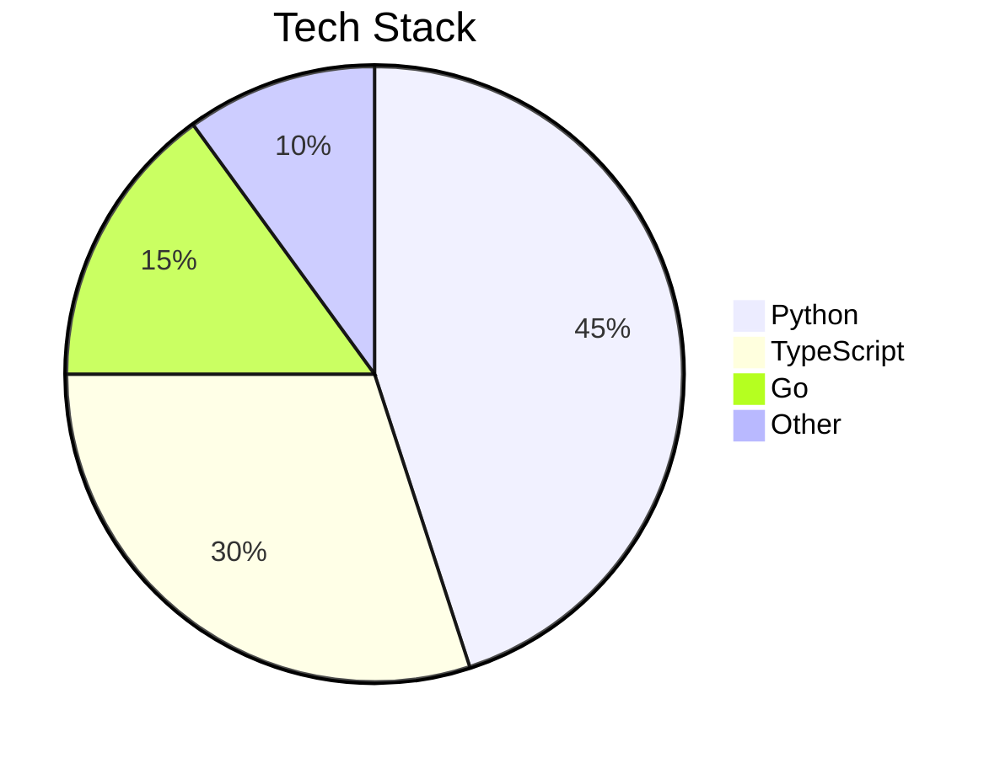

# Heading 1

## Heading 2 — Standard Markdown

Regular paragraph with **bold**, *italic*, ~~strikethrough~~, and `inline code`.

Here is a [link](https://example.com) and some ==highlighted text== (Obsidian).

### Lists

- Item one
- Item two
  - Nested item
  - Another nested
- Item three

1. First
2. Second
3. Third

### Blockquote

> This is a standard blockquote.
> It can span multiple lines.

### Horizontal Rule

---

### Code Block

```python
def greet(name: str) -> str:
    return f"Hello, {name}!"

print(greet("World"))
```

### Table

| Name    | Role      | Score |
|---------|-----------|------:|
| Alice   | Engineer  |    95 |
| Bob     | Designer  |    88 |
| Charlie | Manager   |    72 |

---

## Heading 2 — Obsidian Extensions

### Wikilinks

This document references [[Another Page]] and [[Some Note|a renamed link]].

### Callouts

> [!NOTE]
> This is an informational callout.

> [!WARNING]
> Be careful with this setting.

> [!TIP]
> You can customise callout titles.

> [!DANGER]
> This action is irreversible.

### Tags

Some text with an inline #obsidian-tag and another #project/work tag.

### Obsidian Comments

%%This comment should be stripped from the output.%%

---

## Heading 2 — Mermaid Charts

### Flowchart



### Sequence Diagram



### Pie Chart


